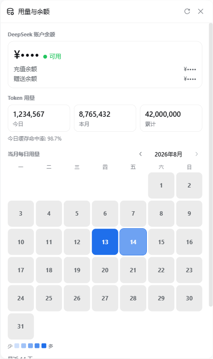

# dsh-usage-stats

[](https://github.com/Ychris12138/dsh-usage-stats/actions/workflows/ci.yml)
[](https://github.com/Ychris12138/dsh-usage-stats/releases)
[](LICENSE)

为 [DeepSeek Harness](https://github.com/deepseek-ai/deepseek-harness) 网页端提供 Token 用量热图、分模型统计和 DeepSeek 账户余额。

Token usage heatmap, per-model breakdowns, and DeepSeek account balance for the DeepSeek Harness Web GUI (`dsh web`).



## 功能 / Features

| 功能 | 说明 |
| --- | --- |
| 账户余额 | 通过 DeepSeek 官方 `/user/balance` API 查询充值、赠送和总余额 |
| 用量概览 | 今日、本月、累计 Token，以及今日缓存命中率 |
| 月历热图 | 按月浏览；颜色越深表示用量越高 |
| 日期下钻 | 点击日期查看分模型 Token、占比和输入/输出/缓存明细 |
| 增量聚合 | 只折叠新增事件；检测到日志截断或重写时自动从头计算 |
| 本机边界 | API 同时校验 peer socket 与 Host；浏览器永远拿不到 API key |

界面支持中文和英文，余额与用量独立刷新；打开面板后立即加载，之后用量每分钟刷新、余额每五分钟刷新。

## 安装 / Installation

### 一条命令安装

需要 DeepSeek Harness 的 `web` profile（面向 `@deepseek-ai/dsh >= 0.1.0-rc.6`），以及随 Node.js 提供的 `npx`。

在 PowerShell、命令提示符或 macOS/Linux 终端运行同一条命令：

```bash
npx --yes github:Ychris12138/dsh-usage-stats
```

安装器会自动完成两件事：把运行文件复制到 `~/.dsh/profiles/node_modules/dsh-usage-stats`，并在 `profiles/web/cordis.patch.yml` 中幂等启用插件。重复运行同一命令即可更新，不会重复添加配置。

如设置了 `DSH_HOME`，安装器会使用该目录而不是 `~/.dsh`。可先预览或只检查现有安装：

```bash
npx --yes github:Ychris12138/dsh-usage-stats --dry-run
npx --yes github:Ychris12138/dsh-usage-stats --check
```

如果不希望安装器修改 Cordis patch，可加 `--no-enable`，再自行配置。

### 可选：配置余额查询

只有余额查询需要 DeepSeek API key。用量统计无需 key；未配置时余额卡会显示凭据缺失。

```yaml
# ~/.dsh/.credentials.yaml
DEEPSEEK_API_KEY: sk-your-key-here
```

安装器不会读取、创建或修改凭据文件。不要把真实 key 提交到 Git，也不要把它粘贴给编码 Agent。

### 重启

```bash
dsh web
```

浏览器硬刷新后，侧边栏底部会出现“用量/余额”（Usage/Balance）入口。

<details>
<summary>无法使用 npx 时：从源码安装</summary>

```bash
git clone https://github.com/Ychris12138/dsh-usage-stats.git
cd dsh-usage-stats
node scripts/install.mjs
```

</details>

## 使用 / Usage

- 点击侧边栏入口打开面板。
- 使用 `‹`、`›` 切换月份，点击“今天”返回当前月份。
- 点击热图日期或最近 14 个日历日列表，查看当天的模型明细。
- 标题栏刷新按钮会同时重新请求用量和余额。

“最近 14 天”按本地日历计算，只显示窗口内存在用量的日期；未来时间戳不会计入该列表。

## Agent 友好安装 / Agent-friendly installation

可以把下面整段直接交给 Codex、Claude Code 或其他本地编码 Agent：

```text
Install or update dsh-usage-stats from:
https://github.com/Ychris12138/dsh-usage-stats

Constraints:
- Resolve DSH_HOME from the environment; otherwise use ~/.dsh.
- Do not read, print, edit, or request .credentials.yaml or any API key.
- Do not expose the plugin through a reverse proxy.
- Do not restart or terminate an existing dsh process without asking me.

Procedure:
1. Confirm node, npx, and dsh are available.
2. Run: npx --yes github:Ychris12138/dsh-usage-stats
3. Require the installer to report a verified package and exactly one Cordis patch entry.
4. Report the resolved install and patch paths.
5. If dsh web is already running, tell me a restart is needed and stop.
```

安装器本身提供清晰的退出码：未知参数返回 `2`；文件、版本或配置验证失败返回非零；成功时输出已验证版本、安装路径和 patch 路径。因此 Agent 不需要自行解析或重写 YAML。

Agent 如果只获准检查而不能修改，应运行：

```bash
npx --yes github:Ychris12138/dsh-usage-stats --check
```

## 隐私与安全 / Privacy & security

- API key 不会发送到浏览器、写入插件缓存或日志。服务端只把它作为 Bearer token，通过 HTTPS 发往 DeepSeek 官方余额 API。
- 余额响应只包含 `isAvailable`、`currency`、`total`、`granted`、`toppedUp` 和 `fetchedAt`，不包含 key。
- 用量缓存在 `~/.dsh/storages/usage-stats-cache.json`，只保存按日期/模型聚合的 Token、会话 id、不透明修订号与折叠游标，不保存提示词、回复正文或文件路径。
- 两个端点仅接受 GET，并同时校验 `req.socket.remoteAddress` 与 Host；支持 IPv4、IPv4-mapped IPv6 和 `[::1]:port`。

本机反向代理会让插件看到代理自身的回环地址。请勿把这些端点经反向代理暴露到局域网或公网；如确需代理，请在代理层增加可靠的认证与访问控制。

安全问题请按 [SECURITY.md](SECURITY.md) 私下报告，不要在公开 issue 中附带 API key、会话内容或可利用细节。

## 聚合与正确性 / Aggregation & correctness

统计值来自 `assistant/chunk` 或 `assistant/message` 事件中的 provider-reported `usage`，不是本地估算。相同 turn/step 的后续 usage 样本会替换前一个样本，与 Harness 的 token usage projection 语义一致。

- 活跃会话只处理内存中新追加的事件。
- 持久化会话优先使用 `sessionPersistence.listSnapshots()` 的不透明 revision；revision 未变化时不读取日志。
- seq 出现缺口、revision 变化但没有新尾部，或 live/persisted 状态切换时，会对该会话完整重折叠。
- 聚合请求采用 single-flight，并在同一临界区内原子写入缓存，避免并发保存覆盖。

开发环境中的真实日志曾以四条路径交叉核对：原始 JSONL/Zstandard artifact、`session.history`、插件端点和官方 `tokenUsage` projection。验证脚本会逐会话比较，并在文件缺失、读取失败、覆盖不完整或数值不一致时返回非零退出码。

## 开发与验证 / Development

客户端是无需构建步骤的手写 `__ModuleLoader__` bundle；服务端是 Cordis 插件，聚合核心位于纯函数模块。

```bash
npm install
npm run check
npm test
npm pack --dry-run
```

`npm test` 完全离线运行：客户端渲染/请求并发/币种回归，以及服务端的 IPv6、外部 peer、GET-only、会话切换和日志重写回归。干净 clone 会从项目 `devDependencies` 解析 React；只有显式设置 `SMOKE_NODE_MODULES` 时才改用其他模块目录。

真实数据集成验证需要先运行 `dsh web`（默认 `127.0.0.1:3080`）：

```bash
npm run validate:live
node scripts/check-balance.mjs
```

`validate:live` 依赖 JSONL/Zstandard 会话 artifact，并要求每个带 token projection 的会话都有可读 raw artifact；否则会明确失败，而不是给出假阳性。`check-balance.mjs` 会访问官方 API 并打印余额响应，适合本机诊断，不应把输出粘贴到公开 issue。

所有服务端脚本都遵循 `DSH_HOME`；未设置时默认为 `~/.dsh`。

## API

| Method | Path | Response |
| --- | --- | --- |
| `GET` | `/api/usage-stats/usage` | 按日期/模型统计的 Token、缓存命中率与更新时间 |
| `GET` | `/api/usage-stats/balance` | 脱敏后的 DeepSeek 余额与获取时间 |

其他方法返回 `405`，非回环请求返回 `403`。响应均为 JSON，并带 `Cache-Control: no-cache`。

## 项目结构

```text
lib/index.js              server routes, incremental cache, balance fetch
lib/usage.js              pure token-usage aggregation
lib/client.js             sidebar panel and heatmap
scripts/smoke-client.mjs  offline client regressions
scripts/install.mjs       cross-platform idempotent installer
scripts/test-install.mjs  installer regression and idempotency test
scripts/test-server.mjs   offline server regressions
scripts/validate-fold.mjs live projection comparison
scripts/verify-raw.mjs    four-path raw-data verification
```

## 兼容性说明

当前版本为 `0.1.0`。插件依赖 DeepSeek Harness 的客户端模块加载器、Cordis 服务和 session persistence 接口；Harness 预发布版本升级后如这些内部接口变化，可能需要同步适配。

## License

[MIT](LICENSE)
